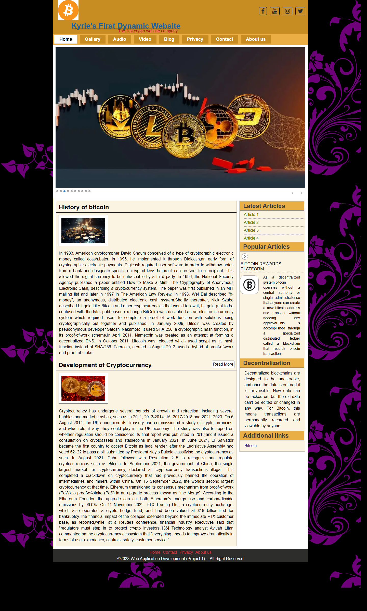

# GalleyWeb

一个以加密货币资讯、多媒体内容和博客展示为主题的静态前端课程项目作品集。  
A static front-end course project portfolio focused on cryptocurrency content, gallery pages, media pages, and blog-style layouts.

Live Demo: [chengyuanzhu11.github.io/galleyweb](https://chengyuanzhu11.github.io/galleyweb/)

## Overview

GalleyWeb 是一个基于 HTML、CSS 和 JavaScript 构建的静态网站项目，最初完成于 `Web Application Development` 课程实践阶段。项目围绕加密货币主题组织内容，在同一个站点中整合了首页轮播、文章阅读、图片分类、多媒体页面以及基础信息页面。

这个仓库的定位是课程项目作品集展示，重点在于呈现前端页面组织、静态站点结构和基础交互效果，而不是通用型产品模板或生产环境项目。

## Features

- 多级导航菜单，覆盖首页、图库、音频、视频、博客、联系和关于页面。
- 首页使用 jQuery Nivo Slider 实现轮播展示，突出加密货币主题视觉内容。
- 采用经典的内容区加侧边栏布局，用于承载文章、推荐列表和辅助信息模块。
- 包含图片、音频、视频等多媒体展示页面，适合课程项目作品集场景。
- 集成 Font Awesome 4.7.0 图标资源，用于社交入口与界面装饰。
- 站点使用纯静态资源组织，适合直接部署到 GitHub Pages。

## Tech Stack

- HTML5
- CSS3
- JavaScript
- jQuery 1.7.1
- [Nivo Slider](https://themeisle.com/plugins/nivo-slider/)
- [Font Awesome 4.7.0](https://fontawesome.com/v4.7.0/)

## Project Structure

```text
galleyweb/
├── index.html
├── about.html
├── contact.html
├── item.html
├── item1.html ~ item4.html
├── Blog1.html ~ Blog4.html
├── article1.html ~ article4.html
├── song1.html ~ song4.html
├── video1.html ~ video4.html
├── post.html
├── style.css
├── css/
│   ├── nivo-slider.css
│   ├── bar/
│   ├── dark/
│   ├── default/
│   └── light/
├── js/
│   ├── jquery-1.7.1.min.js
│   └── jquery.nivo.slider.pack.js
├── images/
├── font-awesome-4.7.0/
└── docs/
    └── homepage-preview.png
```

## Local Preview

这是一个纯静态项目，不依赖后端服务或数据库。

1. 克隆或下载仓库。
2. 进入项目根目录。
3. 直接用浏览器打开 `index.html`，或使用任意本地静态服务器预览。

例如，也可以使用 Python 在本地启动一个简单预览服务：

```bash
python -m http.server 8000
```

然后访问 `http://127.0.0.1:8000/`。

## Screenshots

首页预览：



## Project Background

- 项目类型：静态前端课程项目 / portfolio showcase
- 初始用途：`Web Application Development` 课程作业
- 主题方向：Cryptocurrency、gallery pages、blog content、media display
- 当前仓库目标：以更标准的 GitHub 项目形式展示源码、说明文档和在线预览入口

## Credits & Asset Notice

- 本仓库中的代码主要用于课程项目展示与个人作品集整理。
- 部分文章内容、图片、音频或视频素材来源于互联网或第三方资源，仅用于学习与展示目的。
- 如需将其中素材用于二次分发、商业使用或其他公开项目，请先自行确认对应版权与授权状态。
- 暂未添加开源许可证文件，原因是仓库中包含混合来源的媒体资源，授权边界需要单独确认。
